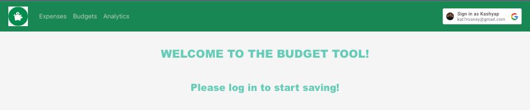
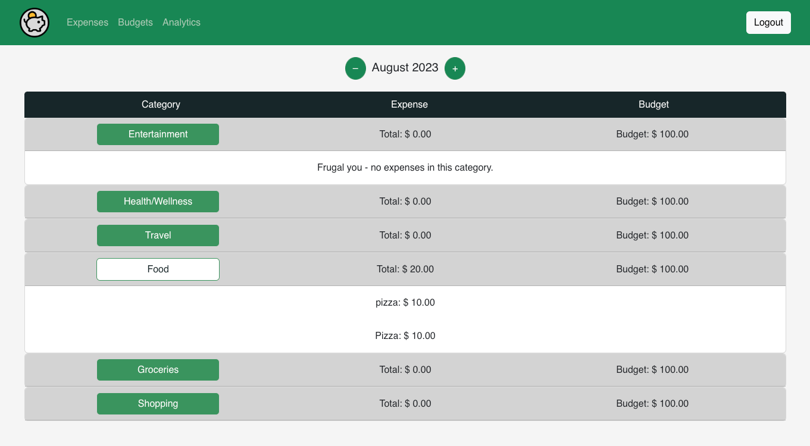
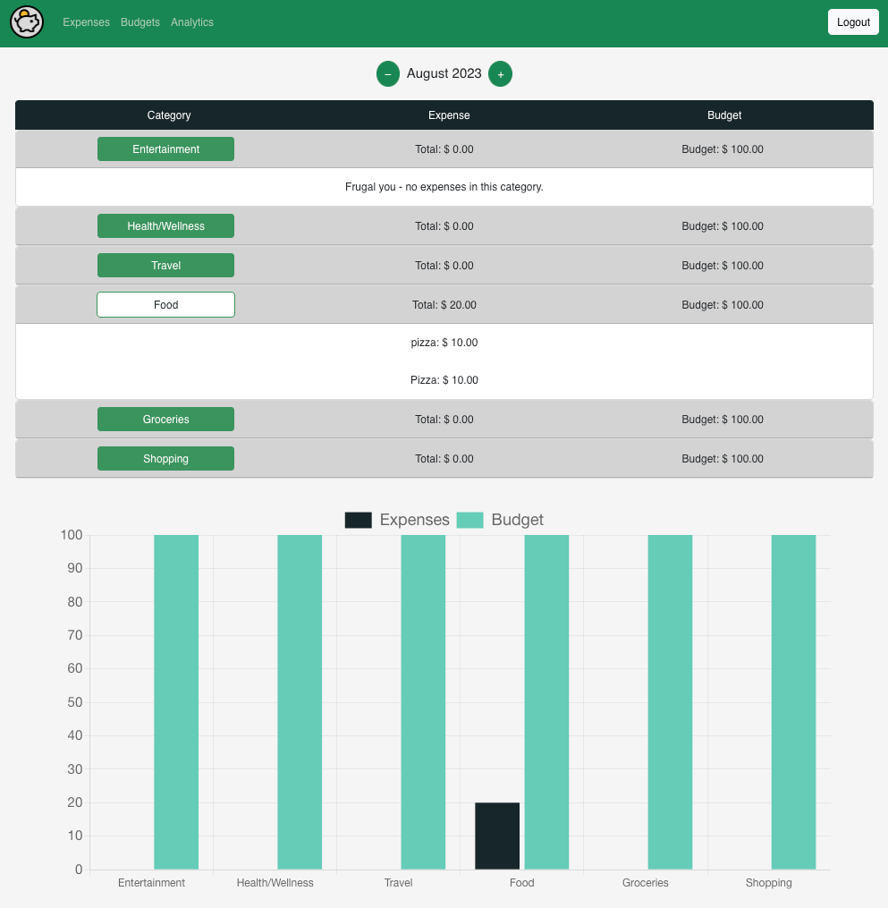
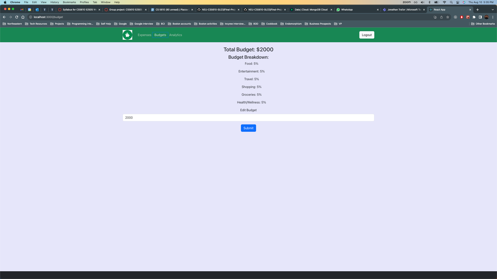
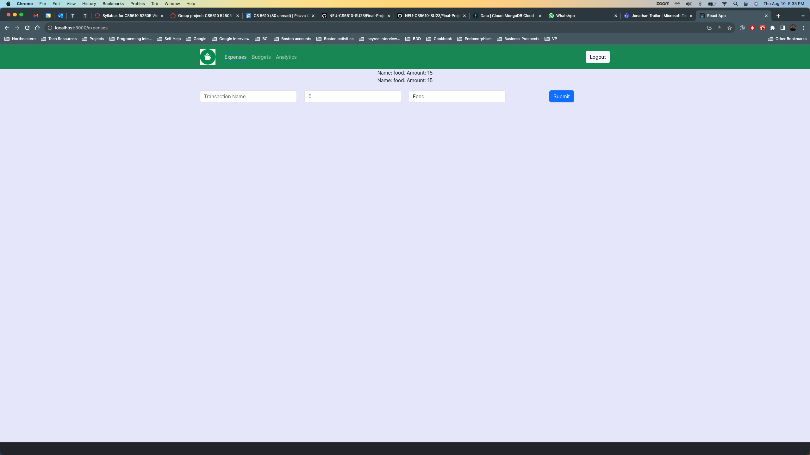
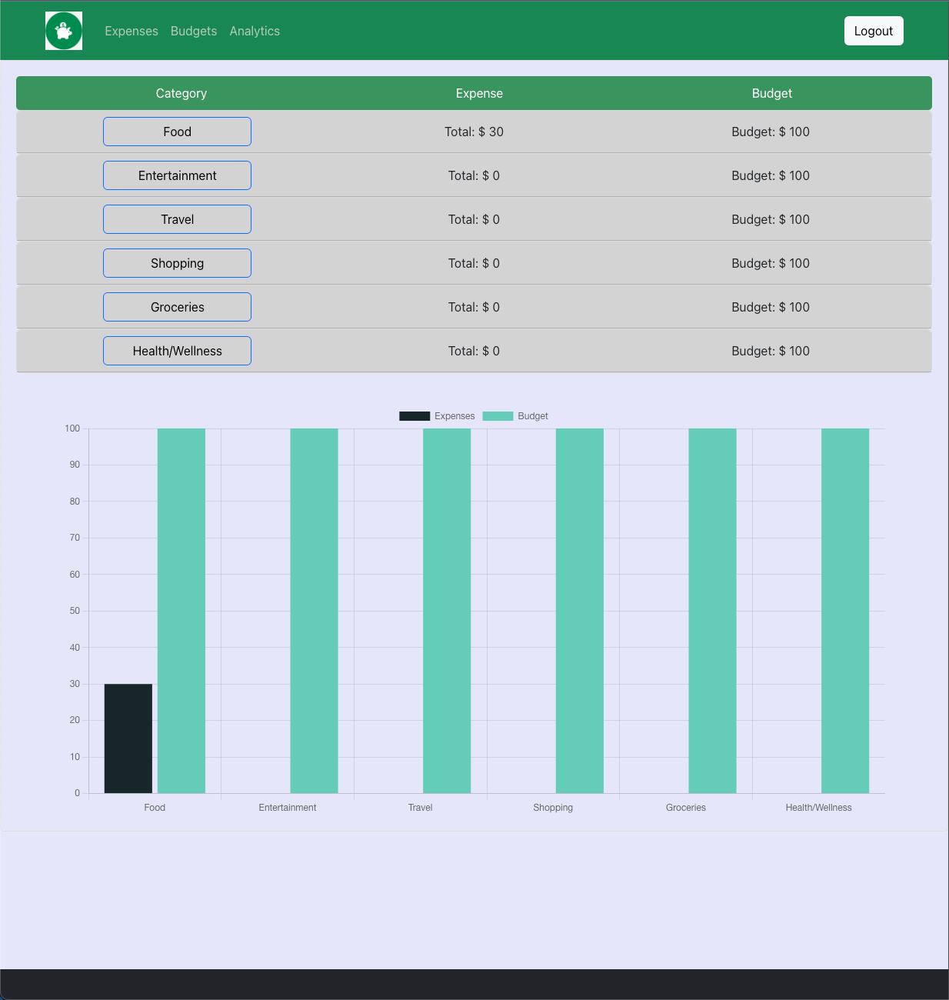
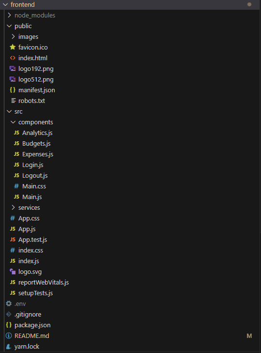
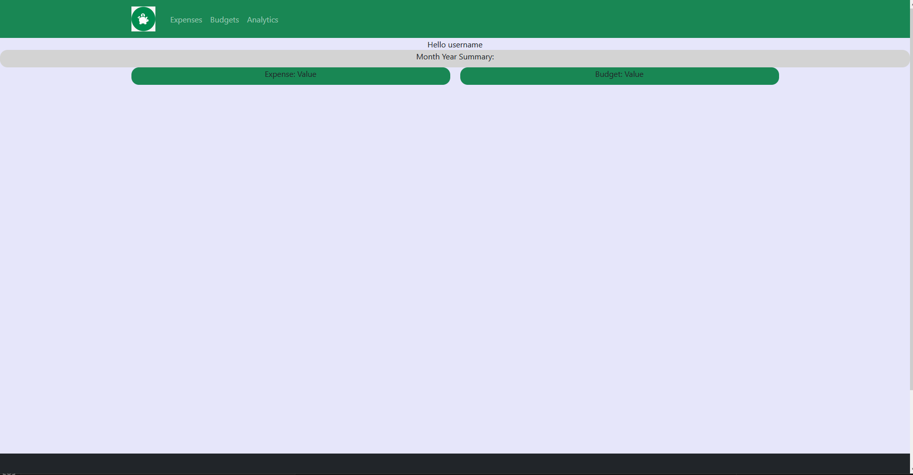

Jonathan Trailor \
Kash Tare \
Anurathi Bala \
CS5610 \
Summer, 2023 \
Final Project \
Group: Team 1

---

#Iteration 3

---

### Tasks Achieved:

> Kash completed all necessary changes for the expenses page  
> Anu completed all necessary changes for the budgets page  
> Jon completed all necessary changes for the analytics page    
> Cleaned up the landing page

### "At least 3 different UI routes (appearing to the user as different pages)":

The following screenshot depicts our different UI routes

### "At least one Bootstrap UI component not featured in the demo application":

We used the Accordion Bootstrap UI component provided by React-Bootstrap

### "3rd party library for React (not including React DnD, unless its use is completely different from the use in the demo project)":

We incorporated the ChartJs library to be able to provide data visualization on the analytics page

#Iteration 2

---

### Tasks achieved:
> Anu added GET and POST calls for user budgets  
> Kash added GET and POST calls for user expenses  
> Jon completed all necessary changes for analytics

### Screenshot of Budgets page

### Screenshot of Expenses page

### Screenshot of Analytics page

#Iteration 1

---

### Tasks achieved:
> Anu created the structure of the frontend application by configuring routing, setting up navigation, handling user authentication, and integrating necessary components and styles using bootstrap framework with CSS styling.

### Screenshot of the overall project structure

### User Interface
 

# GCloud Commands
### List All Projects
*gcloud projects list*
### List Current Project
*gcloud config list*
### Switch Projects For App Deploy
*gcloud config set project < number >*